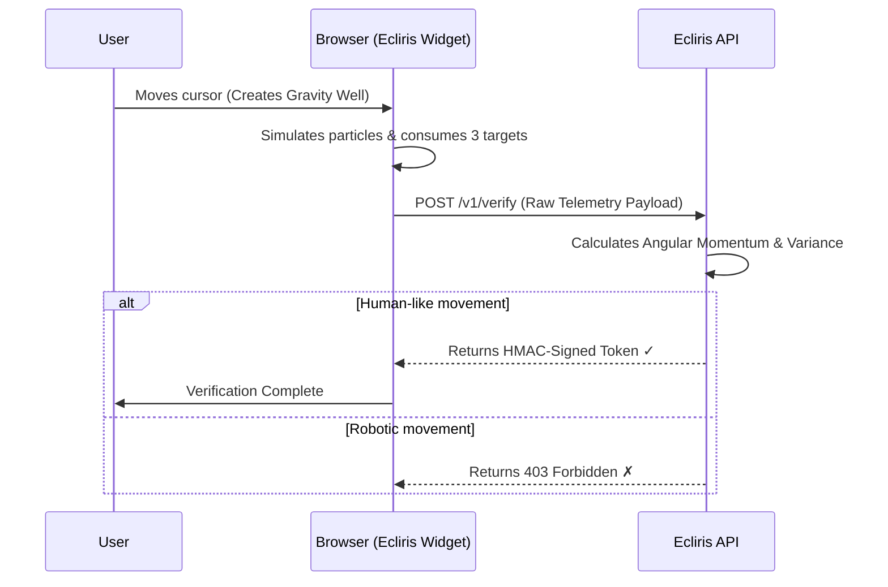

<div align="center">
  <br />
  
  <h1>Ecliris</h1>
  <p><em><strong>Observe the unseen.</strong></em></p>

  <p>
    
    
    
    
  </p>
</div>

<br />

> **Ecliris** is a next-generation visual verification system that transforms the traditional CAPTCHA into an interactive physics simulation. 
> Instead of clicking traffic lights, users control a gravitational singularity to reveal hidden targets in a cosmic nebula.

---

## ✨ Why Ecliris?

| | Feature | Description |
|---|---|---|
| 🌌 | **Physics-Based UX** | Cursor acts as a black hole, pulling particles via real-time gravity simulation. |
| 🧠 | **Behavioral Biometrics** | Bots move in straight lines. Humans orbit. We measure **Angular Momentum**. |
| 🛡️ | **Zero-Trust Security** | Raw telemetry is validated server-side. Client-side spoofing is mathematically blocked. |
| 🧩 | **Shadow DOM Isolation** | 100% CSS isolation. Drops into any website without breaking host styles. |
| ♿ | **Accessible First** | Includes audio alternatives and keyboard fallback paths for motor impairments. |

---

## 🏗️ Architecture

```text
ecliris/
├── packages/
│   ├── core/          # ⚛️ Physics engine (gravity, particles, behavioral math)
│   ├── embed/         # 🖼️ Client-side Shadow DOM widget
│   └── server/        # 🔐 Verification API with server-side analysis
├── playground/        # 🧪 Local development environment
├── pnpm-workspace.yaml
├── package.json
└── tsconfig.base.json
```

---

## 🔄 How It Works



---

## 🚀 Quick Start

### Prerequisites
- **Node.js** `>= 18.0.0`
- **pnpm** `>= 8.0.0`

### Installation & Development

```bash
# 1. Clone the repository
git clone https://github.com/YOUR_USERNAME/ecliris.git
cd ecliris

# 2. Install dependencies
pnpm install

# 3. Build all packages
pnpm build

# 4. Start the verification server
cd packages/server && pnpm start

# 5. Open playground/index.html in your browser (via a local server like `npx serve`)
```

---

## 🔌 Integration

### 1. HTML Setup
```html
<!-- Load the Ecliris widget -->
<script src="https://cdn.yoursite.com/ecliris.js" defer></script>

<form action="/submit" method="POST">
  <input type="email" name="email" required />
  <input type="password" name="password" required />
  
  <!-- Ecliris Container -->
  <div id="ecliris-captcha"></div>
  <input type="hidden" name="ecliris_token" id="ecliris-token" />
  
  <button type="submit" id="submit-btn" disabled>Submit</button>
</form>
```

### 2. JavaScript Initialization
```html
<script>
  window.Ecliris.render('ecliris-captcha', {
    siteKey: 'sk_live_your_site_key',
    apiEndpoint: 'https://api.yoursite.com/v1/verify',
    onSuccess: (token) => {
      document.getElementById('ecliris-token').value = token;
      document.getElementById('submit-btn').disabled = false;
    },
    onError: (error) => console.error('Verification failed:', error)
  });
</script>
```

### 3. Server-Side Validation
```javascript
// In your backend (e.g., Express.js)
app.post('/submit', async (req, res) => {
  const { email, password, ecliris_token } = req.body;
  
  // Validate the token with the Ecliris API
  const isValid = await validateEclirisToken(ecliris_token);
  
  if (!isValid) {
    return res.status(403).json({ error: 'Invalid verification token' });
  }
  
  // Process form...
});
```

---

## 📊 Behavioral Analysis Metrics

Ecliris doesn't just check *if* you clicked the targets; it checks *how* you moved to get there.

*   🌀 **Angular Momentum:** Humans naturally curve and "slingshot" around gravity wells. Bots calculate the shortest path (a straight line). *(Threshold: > 5.0)*
*   📉 **Velocity Variance:** Humans micro-accelerate and decelerate. Bots move at a mathematically constant speed. *(Threshold: > 0.01)*

---

## 📡 API Reference

### `GET /v1/challenge`
Initialize a verification session.
*   **Query:** `siteKey` *(required)*
*   **Response:** `{ "sessionId": "uuid-v4", "status": "ready" }`

### `POST /v1/verify`
Submit telemetry for validation.
*   **Body:**
    ```json
    {
      "siteKey": "your-site-key",
      "telemetry": {
        "path": [{ "x": 100, "y": 200, "t": 1690000000 }],
        "angularMomentum": 12.5,
        "targetsConsumed": 3
      }
    }
    ```
*   **Success Response:** `{ "success": true, "token": "hmac-sha256-signed-jwt", "score": 12.5 }`

---

## ⚙️ Environment Variables

Create a `.env` file in the `packages/server` directory:

```env
PORT=3000
ECLIRIS_SECRET=your-super-secret-key-change-this-in-production
```

---

## 📜 License

Distributed under the **MIT License**. See `LICENSE` for more information.

---

<div align="center">
  <sub>Built with ❤️ and physics for a better, bot-free web.</sub>
</div>
